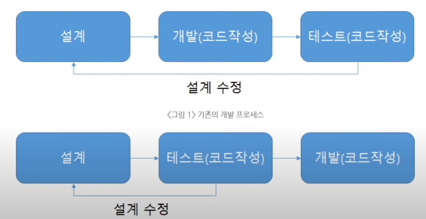
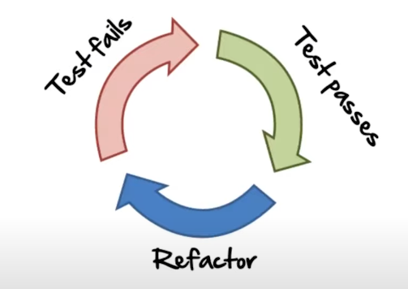

### ❓TDD란 무엇이며 어떠한 장점이 있는가?

#### TDD란 무엇인가
Test-Driven Development(TDD)란 개발자는 요구되는 새로운 기능에 대한 자동화된 테스트케이스를 작성하고 해당 테스트를 통과하는 가장 간단한 코드를 작성하고 상황에 맞게 리팩토링하는 과정을 거치는 것입니다. 
말 그대로 테스트가 코드 작성을 주도하는 개발방식인 것이다.

기존 방법
설계 -> 개발(코드작성) -> 테스트(코드작성)

TDD
설계 -> 테스트(코드작성) -> 개발(코드작성)
1. 요구사항 파악(중요한 부분!)
- 해당 기능의 요구사항과 명세를 정확히 이해하고 있어야 한다
- 사용자 케이스, 사용자 스토리 등으로 이해할 수 있다
2. 테스크 코드(테스트케이스를 자동으로 확인해주는 코드) 작성
3. 테스트 코드가 돌아가도록 작성
4. 리팩토링
5. 다시 1번

#### TDD는 다음과 같은 3가지로 싸이클을 이루고 있다

RED :실패하는 테스트를 구현하고-> GREEN : 테스트가 성공하도록 코드를 구현한다 -> REFACTOR : 프로덕션 코드와 테스트 코드를 리팩토링한다

#### TDD를 왜 해야하는가?
1. 동작하는 코드에 대한 자신감
2. 과도한 설계를 피하고 간결성 증대
3. 실행 가능한 문서를 가짐
4. 디자인적 유연함, 의존성 관리 편함
* 끊임없이 발견되는 버그들을 디버깅하는 과정에서 코드가 더럽혀진다 이러한 이유로 코드량이 방대해지면서 리팩토링을 하게 된다 이 때 테스트 주도 개발을 해왔다면 테스트 코드가 그 중심을 잡아줄 수 있다 한 함수를 여러 함수로 나누는 과정에서 해당 기능이 오작동을 일으킬 수 있지만 테스트를 돌려봄으로써 이에 대한 안심을 하고 계속해서 리펙토링을 진행할 수 있다.
* 결과적으로 리팩토링 속도는 빨라지고 퀄리티도 그만큼 향상(객체지향적이고 확장가능이 용이, 재설계의 시간 단축, 디버깅 시간 단축 할 수 있는 코드)되는 것이다

#### 테스트코드를 왜 작성해야 하는가?
* 새로운 기능을 추가하면 기존 코드가 작동하지 않을 수 있고 개발자가 이를 인지하지 못할 수도 있다 이러한 경우를 방지하기 위해서 테스트 코드를 작성하는 것이다

#### TDD는 설계 방법론이다? -> NO
* TDD는 높은 응집을 유도하지 않는다
* TDD는 단일 책임원칙과 인ㅌ터페이스 분리 원칙 위배에 어떤 신호도 주지 않는다
* TDD는 인터페이스 일관성을 도출하지 않는다
* TDD의 리팩코링 단계는 좋은 구조를 안내하거나 좋은 구조를 갖도록 강제하지 않는다

-> 강한 결합과 의존성역전 원칙 위배를 경고하고 불명확한 설계지점을 발견해주기도 하지만 TDD에만 의존하여 설계한다면 테스트하기에만 좋은 설계가 되어버린다

#### TDD를 실패하는 이유?
-> 구현체가 아니라 인터페이스를 테스트를 해야한다

#### 의문점들
Q. 코드 생산성에 문제가 있지는 않나?
두 배는 아니더라도 분명 코드량이 늘어난다. 비즈니스 로직, 각종 코드 디자인에도 시간이 많이 소요되는데, 거기에다가 테스트 코드까지 작성하기란 여간 벅찬 일이 아닐 것이다. 코드 퀄리티보다는 빠른 생산성이 요구되는 시점에서 TDD 는 큰 걸림돌이 될 수 있다.

Q. 테스트 코드를 작성하기가 쉬운가?
이 또한 TDD 라는 개발 방식을 적용하기에 큰 걸림돌이 된다. 진입 장벽이 존재한다는 것이다. 어떠한 부분을 테스트해야할 지, 어떻게 테스트해야할 지, 여러 테스트 프레임워크 중 어떤 것이 우리의 서비스와 맞는지 등 여러 부분들에 대한 학습이 필요하고 익숙해지는데에도 시간이 걸린다. 팀에서 한 명만 익숙해진다고 해결될 일이 아니다. 개발은 팀 단위로 수행되기 때문에 팀원 전체의 동의가 필요하고 팀원 전체가 익숙해져야 비로소 테스트 코드가 빛을 발하게 되는 것이다.

Q. 모든 상황에 대해서 테스트 코드를 작성할 수 있는가? 작성해야 하는가?
세상에는 다양한 사용자가 존재하며, 생각지도 못한 예외 케이스가 존재할 수 있다. 만약 테스트를 반드시 해봐야 하는 부분에 있어서 테스트 코드를 작성하는데 어려움이 발생한다면? 이러한 상황에서 주객이 전도하는 상황이 발생할 수 있다. 분명 실제 코드가 더 중심이 되어야 하는데 테스트를 위해서 코드의 구조를 바꿔야 하나하는 고민이 생긴다. 또한 발생할 수 있는 상황에 대한 테스트 코드를 작성하기 위해 배보다 배꼽이 더 커지는 경우가 허다하다. 실제 구현 코드보다 방대해진 코드를 관리하는 것도 쉽지만은 않은 일이 된 것이다.

모든 코드에 대해서 테스트 코드를 작성할 수 없으며 작성할 필요도 없다. 또한 테스트 코드를 작성한다고 해서 버그가 발생하지 않는 것도 아니다. 애초에 TDD 는 100% coverage 와 100% 무결성을 주장하지 않았다.

[피카의 TDD와 단위테스트](https://youtu.be/3LMmPXoGI9Q?si=f8f1oYwMbDO3KVJK)
[테스트 주도 개발이 무엇인가](https://youtu.be/xs-yhBlkbbQ?si=ui3GxpsrSVcbm4KJ)