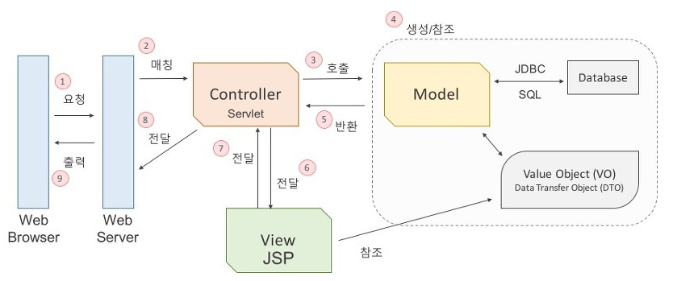
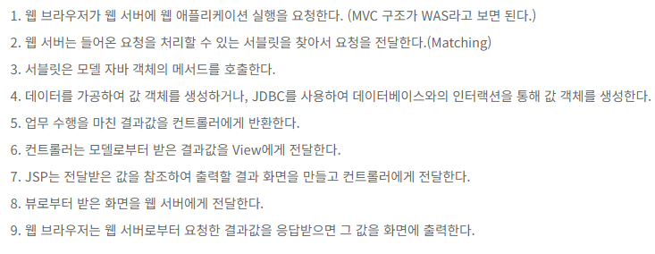

### ❓MVC패턴이란 무엇인가

[10분 테코톡- 제리의 MVC패턴](https://youtu.be/ogaXW6KPc8I?si=EEpRKAlPF-Loot3w)

MVC -> 유지보수가 편해지는 코드 구성 방식
model - 데이터와 관련된 일을 하는 곳
view - 사용자에게 보여지는 부분을 담당하는 곳
contriller - model과 view의 중개자 역할

MVC를 지키면서 코딩하는 방법
1. model은 controller와 view에 의존하지 않는다
(model내부에 controller와 view에 관련된 코드가 있으면 안된다)
2. view는 model에만 의존해야 하고, controller에는 의존하면 안된다
(view 내부에 model의 코드만 있을 수 있고, controller의 코드가 있으면 안된다)
3. view가 model로부터 데이터를 받을 때는, 사용자마다 다르게 보여주어야 하는 데이터에 대해서만 받아야 한다
4. controller는 model과 view에 의존해도 된다
(controller 내부에는 model과 view의 코드가 있을 수 있다)
5. view가 model로부터 데이터를 받을 때, 반드시 controller에서 받아야 한다

[MVC 아키텍쳐에 대한 이해](http://asfirstalways.tistory.com/180)

#### MVC의 각 컴포넌트의 역할
controller
: 클라이언트의 요청을 받았을 때, 그 요청에 대해 실제업무를 수행하는 모델 컴포넌트를 호출한다. 또한 클라이언트가 보낸 데이터가 있다면, 모델에 전달하기 쉽게 데이터를 가공한다. 모델이 마치면 그 결과를 뷰에게 전달한다

model
: 컨트롤러가 호출할 때, 요청에 맞는 역할을 수행한다. 비즈니스 로직이란 업무에 필요한 데이터처리를 수행하는 응용프로그램의 일부라고 할 수 있다. DB에 연결하고 데이터를 추출하거나 저장,삭제,업데이트,변환 등의 작업을 수행한다. 상태의 변화가 있을 때 컨트롤러와 뷰에 통보해 후속 조치 명령을 받을 수 있게 한다

view
: 컨트롤러로부터 받은 모델의 결과값을 가지고 사용자에게 출력할 화면을 만드는 일을 한다. 만들어진 화면을 웹 브라우저에 전송하여 웹브라우저가 출력하게 하는 것이다. 화면에 표시되는 부분으로 추출한 데이터나 일반적인 텍스트 데이터를 표시하거나 입력폼 또는 사용자와의 상호작용을 위한 인터페이스를 표시하는 영역이다

C/S구조로 요청을 하면 그에 맞는 응답을 하는 구조를 기본으로 하고 있다
