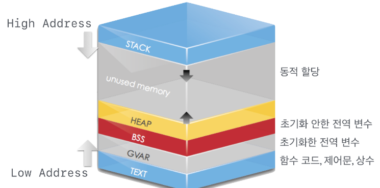
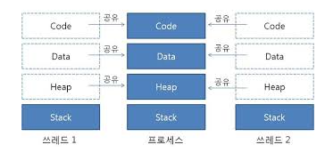

## 프로세스

### 1.2.1 프로세스와 스레드

프로세스
: 컴퓨터에서 실행 중인 하나의 프로그램
: OS로부터 독립된 메모리 영역을 할당받으며 다른 프로세스의 메모리 영역에 접근할 수 없다
프로그램: 특정 작업을 수행하기 위한 명령어의 집합
OS: 프로그램을 실행하면서 디스크에 저장된 데이터 메모리로 로드

스택

: 지역변수, 함수의 매개변수, 반환되는 주소 값

: 높은 주소에서 낮은 주소 값으로 메모리 할당
: 영역의 크기는 컴파일 때 결정

빈 메모리 공간

: 스택 영역과 힙 영역은 동적으로 메모리 할당이 가능해 두 영역 사이에 빈 메모리 공간이 존재

: 스택 오버플로우 -> 스택 영역이 힙 영역을 침범

: 힙 오버플로우 -> 힙 영역이 스택 영역을 침범

힙

: 사용자에 의해 동적 메모리 할당이 일어나는 영역 ex malloc()

: 낮은 주소에서 높은 주소 값으로 메모리가 할당

: 영역의 크기는 런타임때 결정

데이터

: 전역변수, 정적변수, 배열, 구조체 등

: 세부적으로 BSS,데이터 영역으로 나눌 수 있음

: BSS-> 초기화하지 않은 변수 데이터-> 초기화한 변수

코드

: 코드가 기계어로 컴파일 되어 저장

오버플로우 : 메모리 공간에서 할당할 수 있는 최대 범위를 넘어가는 것
언더플로우 : 메모리 공간에서 할당할 수 있는 최소 범위보다 작은 것

스레드

: 프로세스에서 실제로 실행되는 흐름의 단위

: 프로세스의 메모리공간을 이용하고 지역변수를 저장하는 스택 영역을 할당받음

: 힙 영역은 다른 스레드와 공유

### 1.2.2 PCB

: 프로세스를 제어하기 위해 프로세스 정보를 저장하는 것