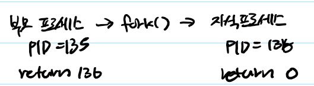
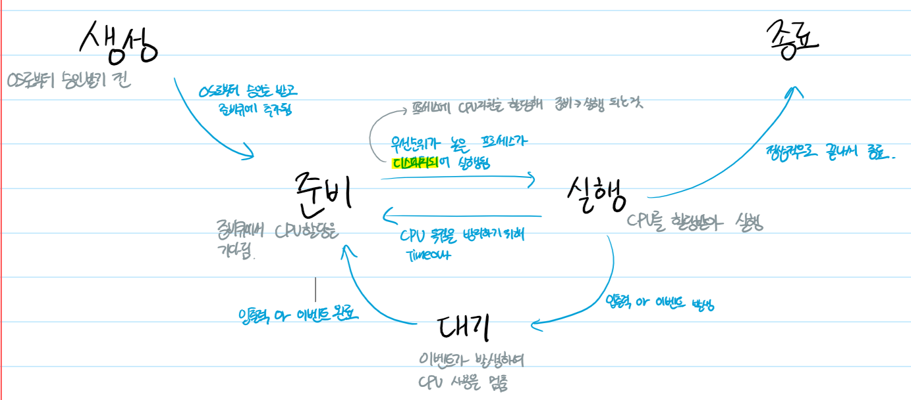
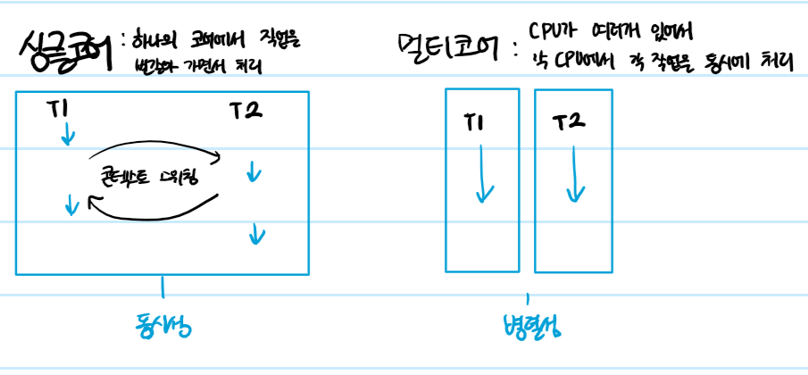

## 프로세스

### 1.2.3 프로세스의 생성

fork()함수를 호출해 생성(복사)

### 1.2.4 프로세스의 상태도

### 1.2.5 멀티 프로세스와 멑티 스레드

멀티 프로세스 : 응용 프로그램 하나를 여러 프로세스로 구성하는 것을 의미

* 한 프로세스가 죽어도 다른 프로세스에 영향을 주지 않기 때문에 여러개로 구성하는게 안정적
* 콘텍스트 스위칭 작업이 이루어지는데 시간고 메모라가 필요, 이를 오버헤드라고 불림
* 프로세는 독립적인 메모리를 할당받는데 프로세스 간에 공유할 자원이 있다면 IPC를 통해서 자원을 공유하기 때문에 직접 참조하는 것보다 비효율적이다

멀티 스레드 : 하나의 프로세스에 스레드를 여러개 생성하는 것을 의미

* 스레드 간에 힙, 데이터, 코드 영역을 공유하기 떄문에 콘텍스트 스위칭할 때 오버헤드가 적게 발생하고 IPC를 사용하지 않아도 된다
* 하지만 스택 영역을 다른 스레드와 함께 사용하기 때문에 공유 자원에 대한 동기화가 필수다
* 스레드에 문제가 생기면 다른 스레드에게도 영향을 미칠 수 있다

### 1.2.6 콘텍스트 스위칭
인터럽트: 입출력 관련 이벤트가 발생하거나 예외 상황이 발생할 때 이에 대응할 수 있게 CPU에 처리를 요청하는 것을 의미

* 입출력 발생
* CPU 사용 시간 만료
* 자식 프로세스 생성

-> 인터럽트가 발생하면서 콘텍스트 스위칭이 이루어짐
여기서 콘텍스트는 프로세스의 정보를 의하고 즉, ㅁ널티 프로세스 환경에서 CPU가 처리 중에 프로세스의 정보를 바꾸는 것이 콘텍스트 스위칭이다

-> 콘텍스트 스위칭 과정에서 상태 저장, 상태 로드할 때 CPU는 아무 일도 못한다 이처럼 어떤 처리를 하는 데 간접적인 처리 시간과 메모리가 소요될 경우에 '오버헤드가 발생한다'고 한다

? CPU에서 처리 중인 프로세스가 중간에 변경되어도 이전에실행하던 코드를 이어서 실행 할 수 있는 이유는?

: PCB에 프로그램 카운터와 스택 포인터 값이 저장되어있기 때문

프로그램 카운터: 프로세스가 이어서 처리해야 하는 명령어의 주소 값

스택 포인터: 스택 영역의 데이터가 채워진 가장 높은 주소 값