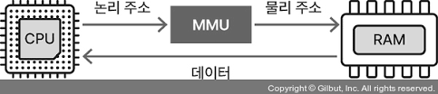

## 메모리 관리 전략

### 1.4.1 논리 메모리와 물리 메모리
CPU가 프로세스를 처리할 때 보는 주소 값과 실제 메모리 주소 값은 다른다
* 논리 메모리 영역(가상 메모리 영역) : 프로세스가 보는 영역
* 물리 메모리 영역 : 실제로 사용되는 메모리 영역
* 논리 주소(가상주소) : CPU가 프로세스를 실행하며 보는 주소 값
* 물리 주소 : 메모리에서 사용되는 주소
* 메모리 관리 장치 : CPU가 프로세스를 실행할 때 사용하는 주소값과 실제 주소값이 다르므로 논리주소를 물리 주소로 변환하는 하드웨어 장치

### 1.4.2 연속 메모리 할당
#### 고정 분할 방식
* 메모리 영역을 분할한 뒤 각 영역에 프로세스를 할당
* 분할된 영역의 크기는 서로 다를 수 있으며, 분할된 크기는 고정
* 프로세스 수롸 각 프로세스 크기가 제한된다는 단점이 있다
* 단편화
    * 외부 단편화 : 고정 분할이기 때문에 크기를 변경할 수 없어서 분할된 크기보다 큰 프로세스를 할당하지 못한다
    * 내부 단편화 : 분할된 크기보다 작은 프로세스를 할당하면 남은 공간이 생긴다
#### 가변 분할 방식
* 할당할 프로세스의 크기에 따라 메모리 공간을 분할하는 방식
* 최초적합
    * 차례대로 프로세스를 로드하는 방식
* 최적적합
    * 할당하려는 프로세스 크기 이상인 공간 중에 가장 작은 프로세스를 할당하는 방식
* 최악적합
    * 할당하려는 프로세스 크기보다 가장 큰 공간에 프로세스를 할당하는 방식

#### 메모리 압축(메모리 집약)
* 외부 단편화 문제를 해결하는 방법
* 흩어져 있는 가용 메모리 공간을 하나로 합치는 것

### 비연속 메모리할당
#### 페이징 [참고자료](https://youtu.be/8ufliWkgqMo?si=rcJjnGa-Ep2ag_hw)
* 연속 메모리 할당의 문제점
   * 외부 단편화
   * 물리 메모리보다 큰 프로세스 실행 불가
> 
❓ 모든 프로세스의 크기가 똑같았다면 외부 단편화가 일어나지 않을 것이다
그래서 페이징은 프로세스를 일정 크기로 자르고, 이를 메모리에 불연속적으로 할당하여 외부 단편화를 해결한다

* 페이징이란?
  * 논리 주소 공간을 페이지라는 일정 단위로 자르고
  * 메모리의 물리 주소 공간을 프레임이라는 페이지와 동일한  일정한 단위로 자른 뒤
  * 페이지를 프레임에 할당하는 가상메모리 관리 기법
  * 내부 단편화는 해결하지 못한다

* 페이징에서의 스와핑
: 프로세스가 이루고 있는 모든 페이지가 전부 다 반드시 메모리에 적재되어 있을 필요는 없고 일부 페이지는 보조 기억 장치의 스왑 영역에 있어도 실행이 가능하다
: 따라서 페이지 아웃, 페이지 인을 통해서 물리 메모리보다 큰 프로세스도 실행할 수 있게 된다

> ❓ 물리 메모리 내에 프로세스들을 불연속적으로 할당하면 CPU는 프로세스가 어디에 저장되어 있는지 어떻게 알까?
그렇기 때문에 "페이지 테이블"을 사용한다

* 페이지 테이블
  * 물리 주소에 불연속적으로 배치되더라도 cpu가 바라보는 논리 주소에는 연속적으로 배치되도록 하는 방법
  * 페이지 번호와 프레임 번호를 짝지어주는 이정표

#### 세그먼테이션
* 프로세스의 메모리 영역을 논리적 단위(기능별로)인 세그먼트로 분할해 메모리를 할당
* 논리적 단위로 나눠 저장하므로 단위별로 데이터를 보호하기 쉽다
  * 하지만 세그먼트의 크기가 균등하지 않아서 외부 단편화가 발생할 수 있다
  * 또한 오버플로가 발생하면 다른 프로세스와 메모리 영역이 겹칠 수 있다

* 세그먼테이션 테이블
: 세그먼트의 논리 주소를 물리 주소로 매핑하는 것
: 세그먼트 번호, 시작 주소(base), 세그먼트 크기(limit)를 가진다

