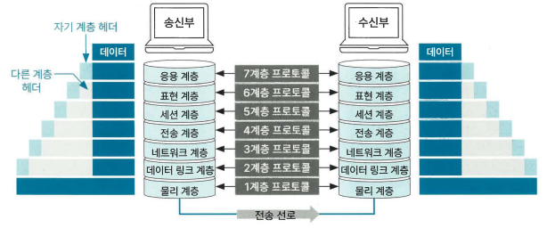

### 네트워크 계층
#### 2.1.1 OSI 계층
> OSI 7계층이란 네트워크 통신이 이뤄지는 과정을 7단계로 나눈 네트워크 표준 모델

* 송수신 흐름
 * 데이터가 송신할 때는 높은 계층에서 낮은 계층으로 전달하고, 데이터가 수신부의 가장 낮은 계층에 도달하면 수신부에서 낮은 계층에서 높은 계층으로 데이터를 전달
* 데이터 캡슐화
 * 헤더 + 트레일러
 * 수신부의 같은 계층에서 데이터 호환성을 높이고 오류의 영향을 최소화한다
* 프로토콜
 * 데이터를 송수신하기 위해 정한 규칙을 의미

#### 2.1.2 TCP/IP 4계층
* TCP/IP 
    * 인터넷에서 데이터를 주고받기 위한 네트워크 프로토콜을 의미한다 
* TCP
    * 데이터를 나눈 단위인 패킷의 전달 여부와 정송 순서를 보장하는 통신 방식
* IP
    * 패킷을 빠르게 보내기 위한 통신 방식을 의미한다

TCP/IP 각 계층의 데이터 흐름과 전송 단위
* 4계층
    * 사용자와 소프트웨어를 연결해 주는 계층
    * HTTP, HTTPS, DNS
* 3계층
    * 데이터의 신뢰성을 보장하며 포트번호로 데이터를 적절한 응용 프로그램에 전달하는 역할
    * TCP, UDP
    * 세그먼트
* 2계층
    * 데이터를 최종 목적지까지 도달할 수 있게 하는 계층
    * IP
    * 패킷, 데이터그램
* 1계층
    * 내트워크 접근 계층
    * 이더넷, WIFI
