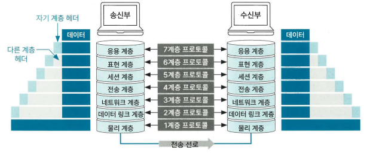

### 네트워크 계층
#### OSI 계층
> OSI 7계층이란 네트워크 통신이 이뤄지는 과정을 7단계로 나눈 네트워크 표준 모델

* 송수신 흐름
 * 데이터가 송신할 때는 높은 계층에서 낮은 계층으로 전달하고, 데이터가 수신부의 가장 낮은 계층에 도달하면 수신부에서 낮은 계층에서 높은 계층으로 데이터를 전달
* 데이터 캡슐화
 * 헤더 + 트레일러
 * 수신부의 같은 계층에서 데이터 호환성을 높이고 오류의 영향을 최소화한다
* 프로토콜
 * 데이터를 송수신하기 위해 정한 규칙을 의미

