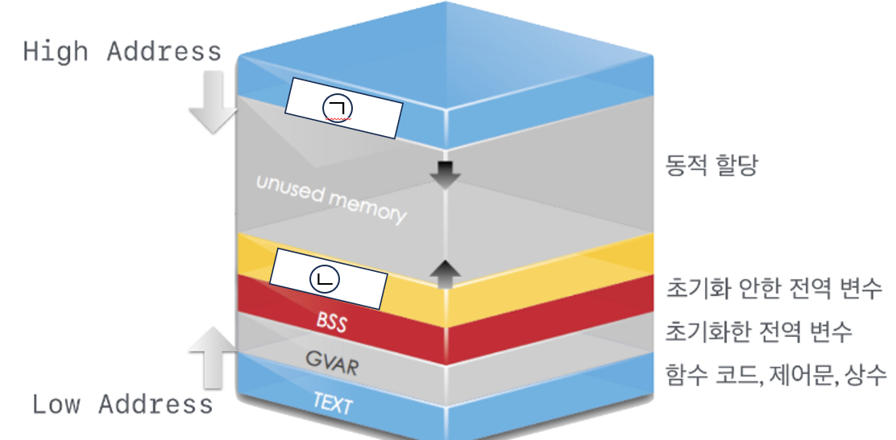
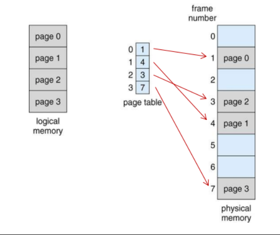
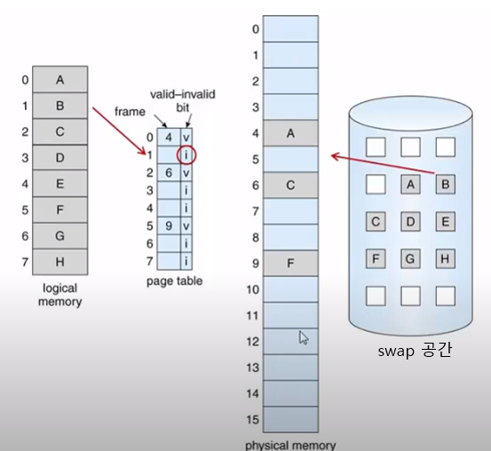

1. 위 그림을 보고 빈칸을 작성하시오
ㄱ: 

ㄴ:

2. ㄱ의 영역 크기는 [  ]일 때 결정됩니다 다음 [  ]이 무엇인지 작성하시오
: 

3. ㄴ은 사용자에 의해 [  ]이 일어나는 영역이다 다음 [  ]이 무엇인지 작성하시오

4. 위 그림은 페이징에 대한 그림이다. 페이징은 연속 메모리 할당의 문제점을 해결하기 위해 만들어졌다고 한다. 그렇다면 페이징은 연속 메모리 할당의 어떤 문제점 때문에 만들어졌는지 다음 보기에서 찾으시오

(1) 분할된 크기보다 작은 프로세스를 할당하면 남은 공간이 생기기 때문이다

(2) 흩어져 있는 가용메모리 공간을 하나로 합치는 방식이 없기 때문이다

(3) 고정분할이기 때문에 크기를 변경할 수 없어서 분할된 크기보더 큰 프로세를 할달하지 못한다

(4) CPU가 프로세스를 실행할 때 사용하는 주소값과 실제 주소값이 다르기 때문이다

(5) 분할된 크기보다 작은 프로세스를 할당하면 남은 공간이 생기지 않기 때문이다

5. 가상메모리는 프로세스의 일부만 메모리에 로드하고 나머지는 디스크에 둔 상태로 프로세스를 실행하는 방식이다. 그렇다면 이러한 방식은 왜 만들어졌는지 1가지만 작성하시오

6. 위 그림은 요구 페이징에대한 그림이다. 이 상태에서 logical memory에 있는 1번 B페이지를 phsical memory에 올릴려고 한다. 이 과정을 valid, invalid 개념을 포함하여 서술하시오
(각 공간에 대한 명칭은 그림에 따라간다)
: