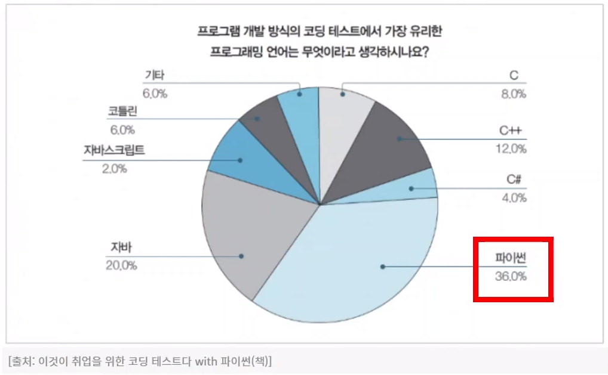

# 코딩테스트란?
: 주로 IT 및 프로그래밍 관련 채용에서 사용되는 시험 방법   
**기술 역량**(알고리즘, 자료구조, 프로그래밍 언어의 이해), **문제 해결 능력**, **코드 구현 능력** 등을 테스트    
기업에서 채점 시스템을 도입하여 응시자 수를 줄이는 효과가 존재

## 코딩테스트 유형
- **온라인**
  플랫폼을 통해 시험 응시 (HackerRank, LeetCode)    
  대체로 인터넷 검색을 허용    
  자신의 개발 환경에서 진행    
- **오프라인**
  회사(시험장)에 방문하여 시험 응시    
  대체로 인터넷 검색 허용되지 않음    
  회사에서 제공하는 환경에서 진행    
  감독관이 있기도 함    

## 코딩테스트 문제 파악하기
1. 문제
2. 코드 작성
3. 실행
4. 감독관
5. 제약조건
6. output

## 기업별 코딩 테스트 유형 분석
기업|풀이시간|문제 개수|커트라인|주요 문제 유형|시험 유형|
|-------------------|------|------|------|----------------------------------------|-----------------------|
|삼성 전자|3시간|2문제|1문제|완전 탐색, 구현, DFS/BFS, 시뮬레이션|오프라인|
|카카오|5시간|7문제|3~4문제|그리디, 구현, 문자열, 자료구조|온/오프라인|
|라인|2시간|5문제|2~3문제|그리디, 구현, 문자열, 탐색, 다이나믹 프로그래밍|온라인|

경우에 따라 SQL이 출제되는 경우도 존재

# 알고리즘 학습법1 (기술 역량)
1. 자료구조
   - Array/List
   - Linked List
   - Stack
   - Queue
   - Dequeue
   - Priority queue
   - Hash Table
   - Graph
   - Tree
   - Heap
2. 알고리즘
   - **Simulation/Implementation**(문제읽고 구현)
   - Search
   - Sort
   - **Greedy** (거스름돈)
   - **Dynamic prgramming**
   - **Dijkstra** (최단거리)
   - Floyd-Warshall
   - Prim
   - Kruscal
   - **DFS** (너비우선탐색 / 2차원 배열 길찾기 문제)
   - **BFS** (깊이우선탐색 / 2차원 배열 길찾기 문제)
  
# 알고리즘 학습법2 (문제 해결 능력)
#### - 문제 해결 능력이란?      
: 주어진 제시문을 잘 이해하고, 문제를 분석하여 해결책을 찾아 내는 능력     
풀이를 말로 설명함으로써 논리적으로 빈약한 부분을 찾을 수 있음     
기술 면접때 면접관이 알고리즘 코드를 왜 이렇게 짰는지 물어보는 경우가 있음     

#### - 알고리즘 문제를 풀다가 막히면 답을 찾아봐야 할까요?     
: **시간을 정해두고 시간 안에 해결하지 못하였을 때** 답을 보기     
   
초반에는 많은 풀이를 보는 게 좋음. 하지만, 직접 손으로 타이핑하여 풀어봐야 함     

# 알고리즘 학습법3 (코드 구현 능력)
1. 기본 문법 학습
2. 기초 알고리즘 문제 풀이
3. 기출 문제 풀이
꾸준히 오래 풀 수 있도록 동기부여 하자!!

#### 코딩테스트는 어떤 프로그래밍 언어로 준비하는게 좋을까요?
: **파이썬**    
   
인공지능의 인기가 증가하고 있으며 파이썬을 사용하는 사람의 비율이 점점 증가하는 추세.   
java, c언어가 주언어일지라도 파이썬으로 알고리즘과 코딩테스트 준비하는 것이 효율적이기 때문에 추천함.    
여러 모듈, 파이썬만이 가지고 있는 장점이 있음, 문자열 처리 등의 효율을 가짐    
</img> 
