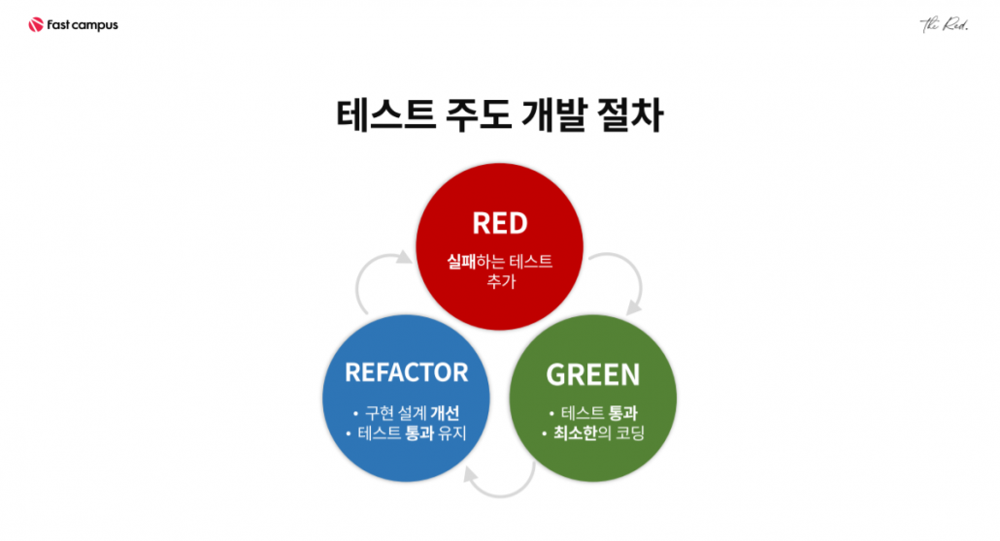

## TDD란?
: Test Driven Development의 약자로 '테스트 주도 개발'이라고 한다.    
반복 테스트를 이용한 소프트웨어 방법론으로 작은 단위의 테스트 케이스를 작성하고,    
이를 통과하는 코드를 추가하는 단계를 반복하여 구현한다.   

</img> 

1. 테스트 작성(Write a Test)   
개발자는 먼저 아직 개발되지 않은 기능 또는 모듈을 테스트하는 테스트 케이스를 작성한다.    
이 테스트 케이스는 예상되는 동작을 설명하고 코드가 기대한 결과를 반환하는지 확인하는 역할을 한다.

2. 코드 작성(Write Code)   
테스트를 작성한 후에, 개발자는 해당 테스트를 통과하기 위한 코드를 작성한다.    
이 코드는 테스트 케이스에 따라 기능을 구현하고, 테스트를 통과하도록 하는 목표를 달성한다.   
이 때, 최소한의 코드를 작성하여 테스트를 통과하는 것을 목표로 하며, 불필요한 코드를 작성하지 않는다.

3. 리팩토링(Refactor)   
코드가 작성되면 개발자는 코드의 가독성, 성능, 유지보수성 등을 향상시키기 위해 리팩토링을 수행한다.   
이는 코드의 구조를 개선하고 중복을 제거하는 등의 작업을 의미한다.   
리팩토링은 코드의 동작을 변경하지 않고 이루어져야 한다.

## TDD의 장점
- 신뢰성 향상
TDD를 통해 작성된 테스트 케이스는 소프트웨어의 기능이 예상대로 동작하는지 확인하는데 도움을 준다.    
이로 인해 신뢰성이 향상되며, 버그를 초기에 발견하여 수정할 수 있어 더 안정적인 소프트웨어를 개발할 수 있다.   

- 빠른 피드백
TDD를 사용하면 코드를 작성하기 전에 테스트를 실행하여 빠른 피드백을 받을 수 있다.    
이로 인해 오류를 더 빨리 발견하고 수정할 수 있으며, 개발 과정에서 시간과 비용을 절약할 수 있다.

- 문서화
테스트 케이스는 소프트웨어의 동작을 문서화하는 역할을 한다.    
코드를 이해하는 데 도움이 되며, 새로운 개발자나 유지보수 작업을 하는 개발자에게도 큰 도움이 된다.   

- 유연성 및 확장성
TDD를 따르면 코드가 모듈화되고 더 작은 기능 단위로 나뉘므로, 새로운 기능을 추가하거나 기존 기능을 확장하기가 더 쉬워진다.   

- 유지보수 용이성
TDD는 리팩토링을 촉진한다. 코드를 개선하고 유지보수하기 쉬운 형태로 변경할 수 있으며, 이로 인해 코드 품질이 높아진다.

## TDD의 단점
- 학습 곡선
처음에는 TDD의 원칙과 패턴을 익히는 데 시간이 걸릴 수 있다. 특히 처음 사용하는 개발자에게는 학습 곡선이 존재할 수 있다.

- 추가 작업
TDD를 따르면 테스트 케이스를 먼저 작성해야 하므로 개발 초기 단계에서는 추가 작업으로 느껴질 수 있다.

- 완벽한 커버리지 보장의 어려움
모든 가능한 상황을 테스트하는 것은 어려울 수 있으며, 모든 코드 경로를 완벽하게 테스트하는 것이 실현 가능하지 않을 때가 있다.

- 과도한 테스트 코드
너무 많은 테스트 케이스를 작성하면 유지하기 어려울 수 있으며, 테스트 코드 자체가 버그를 포함할 가능성이 있다.

- 테스트와 코드의 동기화
코드가 변경될 때마다 관련된 테스트도 변경되어야 한다. 이 동기화를 유지하는 것이 중요하지만, 때로는 빠뜨릴 수 있다.