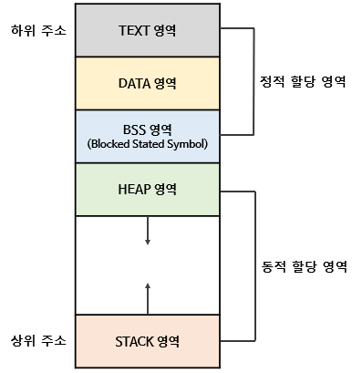
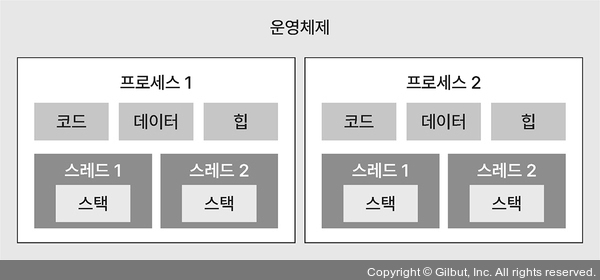

## 프로세스란?   
: 컴퓨터에서 실행 중인 하나의 프로그램(특정 작업을 수행하기 위한 명령어의 집합)

## 프로세스의 역할   
: OS로부터 독립된 메모리 영역(코드, 데이터, 스택, 힙)을 할당받음,한 개 이상의 스레드를 갖음   
-> 다른 프로세스의 메모리 영역에 접근 불가      

## 프로세스의 메모리 영역 구조   
</img>    

- 스택(stack)   
: 지역 변수, 함수의 매개변수(parameter), 반횐되는 주소 값 등이 저장되는 영역   
**높은 주소 값에서 낮은 주소 값으로** 메모리가 할당됨, 영역 크기는 **컴파일 때** 결정됨   
- 힙(heap)   
: 사용자에 의해 동적 메모리 할당이 일어나는 영역   
C언어에서 malloc()로 할당되는 영역   
**낮은 주소 값에서 높은 주소 값으로** 메모리가 할당됨, 영역 크기는 **런타임때** 결정됨   
- 데이터(data)   
: 전역 변수, 정적 변수, 배열, 구조체 등이 저장되는 영역   
세부적으로 BSS(Block Stated Symbol) 영역[초기화 하지 않은 변수 저장]과 데이터 영역[초기화 한 변수저장]으로 나눌 수 있음.    
- 코드(code)   
: 실행할 코드가 기계어로 컴파일되어 저장되는 영역 = 테스트 영역   

## 스레드(thread)란?   
: 프로세스에서 실제로 실행되는 흐름의 단위   

## 스레드의 역할?   
1. 프로세스 안에 존재하여 프로세스의 메모리 공간을 이용   
2. 지역 변수를 저장하는 스택 영역을 할당 받음   
3. 전역 변수를 저장하는 힙 영역은 다른 스레드와 공유함   

## 운영체제에서 프로세스와 스레드의 구조   
</img>    
