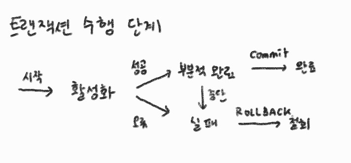
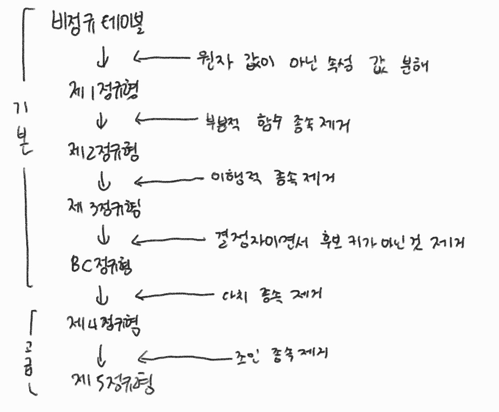

# 3장 - 데이터베이스

## 3.3 트랜잭션

### 3.3.1 트랜잭션

데이터베이스의 상태를 바꾸기 위해 수행하는 작업의 단위 또는 일련의 연산

* DB의 트랜잭션의 특징 ACID
  * Atomicity(원자성) 트랜잭션이 DB에 완전히 반영되거나 아예 실행되지 않아야 함
  * Consistency(일관성) 트랜잭션 수행이 완료된 DB는 
  * Isolation(독립성) 수행 중인 트랜잭션에 다른 트래잭션이 끼어들 수 없음
  * Durability(영속성) 트랜잭션의 결과가 DB에 영구적으로 반영됨

* TCL - 트랜잭션 제어 명령어
  * COMMIT: 트랜잭션이 정상적으로 종료되어 변경 사항을 반영
  * ROLLBACK: 트랜잭션이 비정상적으로 종료되어 트랜잭션이 수행한 변경 사항을 취소하고 DB상태를 이전으로 되돌림
  * SAVEPOINT: 트랜잭션에서 특정 지점을 지정하는 명령어로, ROLLBACK과 함께 사용하면 해당 지점까지 되돌릴 수 있음

### 3.3.2 락 ⭐

락이란? 트랜잭션 처리 순서 보장 방법 (운영체제 부분의 상호배제 기법과 유사)

* 락의 종류
  * 공유 락(=read lock): 일관성에 영향을 주지 않아 데이터에 여러 공유 락이 동시 접근 가능
  * 베타 락(=write lock): 일관성을 유지하기 위해 데이터에 하나의 베타 락이 접근 주일 때 다른 베타 락이 접근할 수 없음

* 트랙잭션의 교착 상태 해결 방법
  * 예방 기법: 트랜잭션 처리가 시작되기 전, 필요한 데이터에 대해 미리 락을 얻음
  * 회피 기법: 트랜잭션 들어온 순서대로 교착 상태 회피
    * wait-die: 데이터의 락을 요청하려는 트랜잭션이 해당 데이터에 대해 이미 락을 가지고 있는 트랜잭션보다 오래되었다면 락을 얻을 때까지 기다림, 아니라면 락 획득을 포기(die)
    * wound-wait: 데이터의 락을 요청하려는 트랜잭션이 해당 데이터에 대해 이미 락을 가지고 있는 트랜잭션보다 오래되었다면 락을 빼앗는다. 아니라면 락 획득을 기다림(wait)

### 3.3.3 이상 ⭐

삽입 이상, 갱신 이상, 삭제 이상

### 3.3.4 정규화

정규화란? DB 이상현상을 해결하기 위해 테이블을 분해하는 것

테이블을 분해하느라 연산 시간이 증가한다 -> 적절한 정규화 필요

정규형 - 정규화한 결과

정규화 단계

역정규화(반정규화) - 낮은 정규화 단계의 테이블로 되돌리는 것
