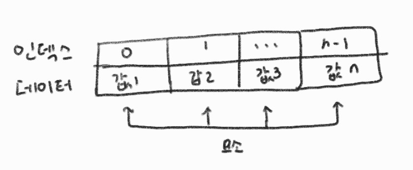
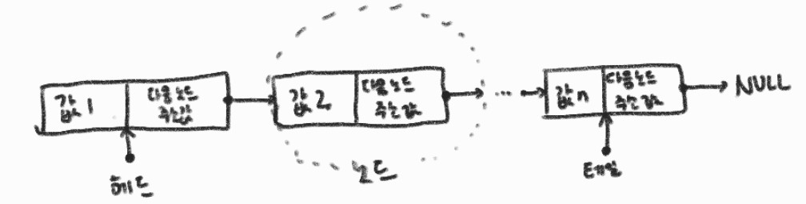
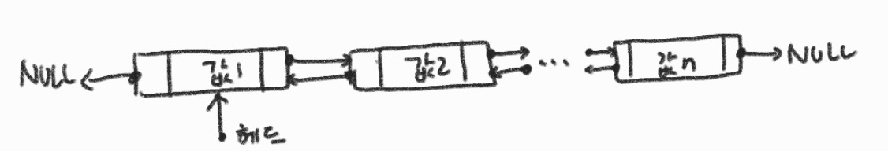
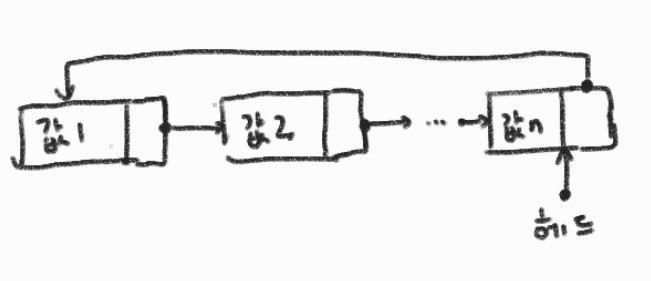
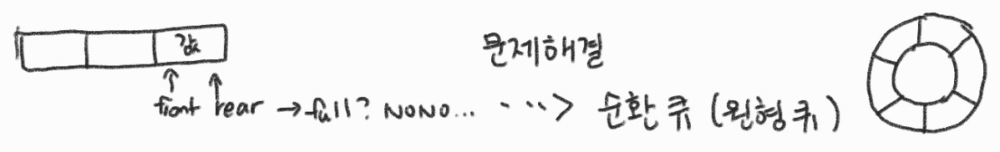

# 4장 - 자료구조

## 4.2 선형 자료구조

### 4.2.1 배열

접근 O(1)
검색 O(N)
삽입(끼워놓기) O(N) (기본 데이터를 뒤로 한칸씩 미뤄야 하기 때문)
삭제(빼어내기) O(N) (기본 데이터를 앞으로 한칸씩 땡겨야 하기 때문)

### 4.2.2 연결 리스트

검색 O(N)
삽입 O(1) (다음 노드 주소 값을 새로운 노드 주소로 하고 새로운 노드의 다음 노드 주소 값을 기존의 다음 노드 주소 값으로 하면 끝)
삭제 O(1) (삭제할 노드 전 다음 노드 주소 값을  삭제할 노드의 다음 주소 값으로 하면 끝)

#### 연결 리스트의 종류

1. 이중 연결 리스트

2. 원형 연결 리스트

### 4.2.3 스택 ⭐

LIFO 후입선출

push O(1)
pop O(1)
peek O(1) (후입 데이터 확인)
isEmpty O(1)
isFull O(1)

### 4.2.4 큐 (중요) ⭐

FIFO 선입선출

대게 맨 앞을 front, 맨 뒤를 rear이라고 함

enqueue O(1) (rear)
dequeue O(1) (front)
peek O(1) (데이터 확인) (front)
isEmpty O(1)
isFull O(1)

