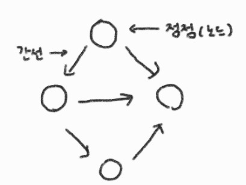
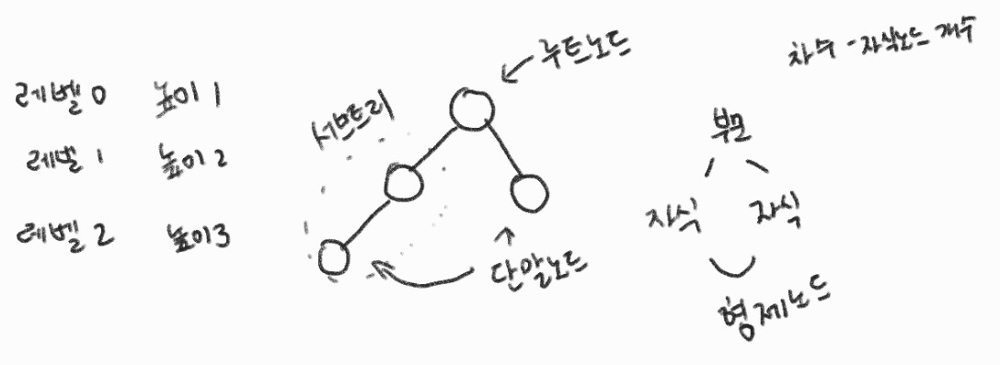
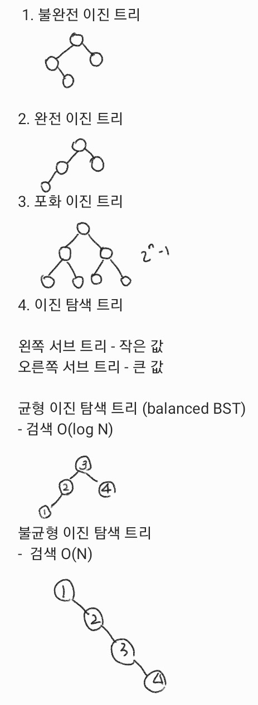
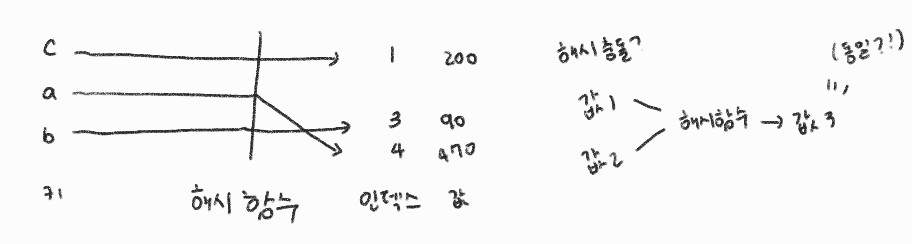

# 4장 - 자료구조

## 4.3 비선형 자료구조

### 4.3.1 그래프 (중요) ⭐

인접: 두 정점이 간선으로 연결 되어 있다

차수: 정점에 연결된 간선의 수

진입 차수: 해당 정점으로 향하는 간선의 수

진출 차수: 해당 정점에서 나가는 간선의 수

경로: 한 정점에서 다른 정점으로 이어지는 정점들의 리스트

경로 길이

단순 경로: 모두 다른 정점으로 구성된 경로

사이클: 한 정점에서 시작해 같은 정점으로 돌아올 수 있는 경로

#### 그래프의 종류

1. 무방향 그래프
2. 방향 그래프

#### 경로 탐색

1. 너비 우선 탐색 (BFS)

(인접한 정점 모두 큐에 삽입하는 방식)
2. 깊이 우선 탐색 (DFS)

(인접한 정점 한 개만 스택에 삽입하는 방식)

### 4.3.2 트리 ⭐

#### 이진 트리

### 4.3.3 우선순위 큐

구현 방법                   삽입 시간 복잡도    삭제 시간 복잡도
unsorted array                  O(1)                O(N)
unsorted linked list            O(1)                O(N)
sorted array                    O(N)                O(1)
sorted linked list              O(N)                O(1)
heap                                    O(logN)

### 4.3.4 힙 ⭐

완전 이진 트리 / 부모로 갈 수록 큰 값(최대 힙) or 작은 값 (최소 힙)

### 4.3.5 해시 테이블 ⭐

#### 해시 충돌 해결 방법

1. 체이닝

같은 해시가 나오는 키의 값을 연결리스트에 저장
2. 개방 주소 법

비어 있는 공간에 값을 저장

* 비어 있는 공간 찾는 법

1. 선형 조사법: H[N]에서 해시 충돌이 발생 시, H[N+1], H[N+2] ...과 같이 이동하기 -> 군집화 발생 가능

2. 이차 조사법: H[N+1x1], H[N+2x2] ...과 같이 이동

3. 이중 해싱
