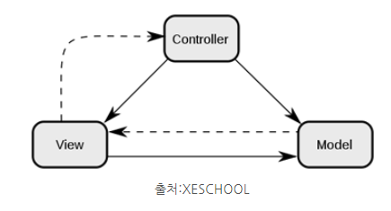

# 개발 상식 no.6

## MVC 패턴

Model, View, Controller의 약자
하나의 애플리케이션, 프로젝트를 구성할 때 그 구성요소를 위의 세 가지의 역할로 구분한 패턴

controller를 조작하면 controller는 model을 통해서 데이터 가져옴
데이터를 바탕으로 view가 시각적인 표현을 통해 사용자에게 전달

model

* 애플리케이션의 정보, 데이터를 나타냄
* 사용자가 편집하길 원하는 모든 데이터를 가지고 있어야 함
* 데이터 변경에 대한 이벤트를 정의해야 함

view

* 사용자 인터페이스
* 모델이 가지고 있는 정보를 따로 저장하면 안 됨
* 변경에 대한 이벤트를 정의해야 함

컨트롤러

* model과 view를 잇는 역할
* 모델이나 뷰에 대해 알고 있어야 함

ex. 구글의 Angular JS, php의 코드이그나이터, python, django

## MVC 패턴을 사용해야 하는 이유

사용자가 보는 페이지, 데이터처리, 그리고 이 2가지를 중간에서 제어하는 컨트롤, 이 3가지로 구성되는 하나의 애플리케이션을 만들면 각각 맡은바에만 집중을 할 수 있음
-> 유지보수성, 애플리케이션의 확장성, 그리고 유연성이 증가하고, 중복코딩이라는 문제점 또한 사라지게 됨
