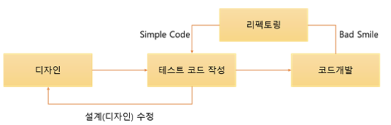

# 개발 상식 no.4

## TDD란?

Test-Driven Development
반복 테스트를 이용한 소프트웨어 방법론
작은 단위의 테스트 케이스 작성, 이를 통과하는 코드를 추가하는 단계를 반복하여 구현
짧은 개발 주기의 반복에 의존하는 개발 프로세스
애자일 방법론 XP의 'Test-First' 개념에 기반을 둔 단순한 설계

## TDD 개발주기

Red - 실패하는 테스트 코드
Green - 테스트 코드를 성공시키기 위한 실제 코드
Blue - 중복 코드 제거, 일반화 등의 리펙토링 수행

## TDD 개발의 특징

⭐ 테스트 코드 작성 후, 실제 코드 작성
-> 테스트 케이스 작성으로 인해 재설계 시간이 절감
(디자인 단계에서 프로그래밍 목적을 반드시 미리 정의)

## TDD의 장점

1. 디버깅 시간 단축
    유닛 테스팅이기에 부분적으로 테스팅이 가능
2. 빠른 피드백
3. 기능 단위 테스팅이기에 정확한 문제 발견이 가능
4. 생산성 증가
    테스트를 통해 불안정성을 개선 가능
5. 재설계 시간 단축
   테스트 코드 작성이 먼저 이기에 개발자 목적이 분명
6. 추가 구현의 용이성
   기능 추가에 있어서 기존 코드로의 영향에 대한 우려를 자동화된 유닛 테스팅으로 테스트 기간을 단축시킴으로 덜 수 있음
