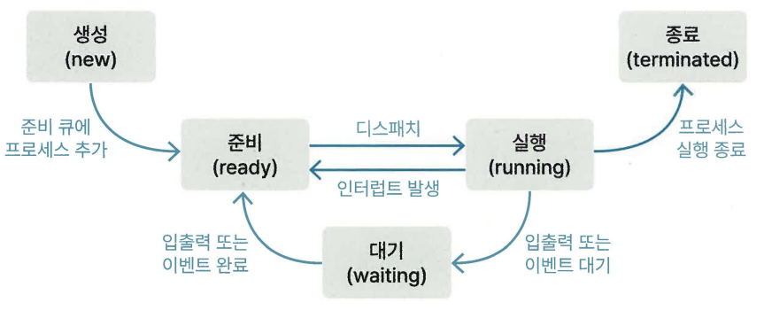
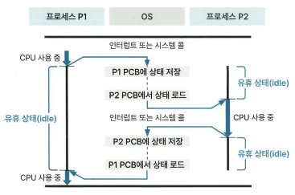

# 1장 - 운영체제

## 1.2 프로세스

### 1.2.3 프로세스의 생성 ⭐

fork()

* 프로세스를 생성하는 함수
* 함수를 호출한 프로세스를 복사
* 기본 프로세스: 부모 프로세스(PID값을 반환) / 복사된 프로세스: 자식 프로세스(0을 반환)

#### 프로세스를 종료

프로세스가 종료되는 경우

* 프로세스가 운영체제의 종료 서비스(exit())를 호출해 정상 종료
* 프로세스의 실행 시간 또는 특정 이벤트 발생을 기다리는 시간이 제한된 시간을 초과
* 프로세스가 파일 검색 또는 입출력에 실패
* 오류 발생 혹은 메모리 부족

자식 프로세스를 종료시킬 경우

* 자식 프로세스가 할당된 자원을 초과
* 자식 프로세스에 할단된 작업이 없는 경우

### 1.2.4 프로세스 상태도 ⭐

프로세스 상태 5가지

* 생성(new)         프로세스가 PCB를 가지고 있지만 OS로 부터 승인(admit) 받기 전
* 준비(ready)       OS로부터 승인받은 후 준비 큐에서 CPU 할당을 기다림
* 실행(running)     프로세스가 CPU를 할당받아 실행
* 대기(waiting)     프로세스가 CPU 사용을 멈추고 입출력이나 이벤트 발생을 기다림
* 종료(terminated)  프로세스 종료

프로세스의 상태 변화

* 생성 -> 준비    생성 상태의 프로세스가 OS로부터 승인을 받아, 준비 상태의 프로세스가 모여 있는 자료구조인 준비 큐(ready queue)에 추가됨
* 준비 -> 실행    준비 큐에 있는 프로세스 중 우선순위가 높은 프로세스가 디스때치 (dispatch) 되어 실행됨
* 실행 -> 준비    CPU 독점을 방지하기 위해 타임아웃(timeout) 되어 준비 상태로 변경됨
* 실행 -> 대기    입출력 또는 이벤트를 기다림
* 대기 -> 준비    입출력 또는 이벤트가 완료됨
* 실행 -> 종료    실행 중인 프로세스가 정상적으로 끝남

➕ PCB란? process control block / 프로세스를 관리하는 데이터 구조
➕ 승인(admit)란? CPU를 제외한 다른 자원이 준비되어 해당 프로세스가 준비 상태가 될 수 있도록 OS가 허락하는 것
➕ 디스패치(dispatch)란? 프로세스에 CPU 자원을 할당해 해당 프로세스가 준비 상태에서 실행 상태가 되는 것

### 1.2.5 멀티 프로세스와 멀티 스레드 ⭐

동시성 - 싱글 코어에서 여러 작업을 번갈아 가며 처리
병렬성 - 멀티 코어로 CPU에서 각 작업을 동시에 처리

#### 멀티 프로세스

응용 프로그램 하나를 여러 프로세스로 구성하는 것
오버 헤드: CPU에서 처리중인 프로세스를 교체하는 작업이 이루어져야 하는데, 기존 CPU에서 기존에 처리하던 프로세스가 할당받은 메모리 영역을 다른 프로세스가 사용할 수 있게 교체하며 필요한 시간과 메모리
IPC - 프로세스는 독립적인 메모리 할당 ---> 프로세스 간에 공유할 자원이 필요할 때 사용하는 프로세스 통신 방법

장점: 프로세스끼리 영향 X -> 응용 프로그램을 프로세스 하나로 구성하는 것보다 여러 개로 구성하는 것이 안정적
단점: 시간과 메모리 공간을 많이 사용

#### 멀티 스레드

스레드 여러 개를 생성해 각자 다른 작업을 하는 것
스레드 간에 힙, 데이터, 코드 영역 공유
CPU에서 처리중인 프로세스를 교체시, 오버헤드가 적게 발생하고 IPC를 사용하지 않아도 됨
장점: 스레드 간 자원 공유가 프로세스 간 자원 공유보다 시스템 처리 비용이 적고 프로그램 응답 시간도 단축
단점: 스레드에 문제가 생기면 프로세스 내 다른 스레드에 영향 미칠 수 있음

### 1.2.6 콘텍스트 스위칭 ⭐

멀티 프로세스 / 멀티 스레드 부분에서 나온 "CPU에서 처리중인 프로세스를 교체시"를 의미

멀티 프로세스 환경에서 입터럽트로 인해 콘텍스트 스위칭 발생

인터럽트란? CPU에서 프로세스를 처리하다가 입출력 관련 이벤트가 발생하거나 예외 상황이 발생할 때 이에 대응할 수 있도록 CPU에 처리를 요청하는 것
입터럽트 발생하는 경우 1. 입출력 발생 2. CPU 사용 시간 만료 3. 자식 프로세스 생성

콘텍스트란? CPU가 처리하는 프로세스 정보

p1의 정보를 PCB에 저장, P2의 PCB에 저장된 정보를 레지스터에 로드하는 동안 CPU가 아무 일을 못하는 경우를 "오버헤드가 발생한다"라고 함

PC - 프로세스가 이어서 처리해야 하는 명령어의 주소 값
스택 포인터 - 스택 영역에서 데이터가 채워진 가장 높은 주소 값(스택 주소라는 뜻)
위 두 정보를 PCB가 가지고 있기에 프로세스 변경에도 실행하던 코드를 이어서 실행할 수 있는 것!
