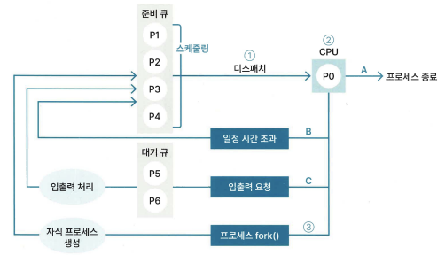

# 1장 - 운영체제

## 1.3 스케줄링

### 1.3.1 스케줄링의 목적

* 공평성 - 모든 프로세스가 공평하게 실행해야 함
* 효율성 - 자원이 사용되지 않는 시간을 최소한으로 해야 함
* 안정성 - 우선순위의 프로세스를 먼저 처리해야 함
* 반응 시간 보장 - 프로세스가 오랜 시간 응답이 없으면 사용자가 시스템이 멈추었다고 인식하기에 일정 시간 내에 응답할 수 있어야 함
* 무한 연기 방지 - 특정 프로세스에 대한 처리가 무한히 연기 되지 않아야 함

### 1.3.2 스케줄링의 단계 ⭐

* 장기 스케줄링(= job 스케줄링)(= 승인 스케줄링) - 준비 큐에 어떤 프로세스를 넣을 지 결정해 메모리에 올라가는 프로세스 수를 조절 (최근은 사용 잘 안함)
* 중기 스케줄링 - 메모리에 로드된 프로세스 수를 동적으로 조절
    메모리에 프로세스가 많이 로드 되면 스왑 아웃해서 일부 프로세스를 통째로 저장
    스왑 아웃된 프로세스는 중단 상태가 됨
    준비 상태에서의 스왑 아웃된 중단 상태는 '중단된 준비 상태'
    대기 상태에서의 스왑 아웃된 중단 상태는 '중단된 대기 상태'
* 단기 스케줄링 (= cpu 스케줄링) - 준비 큐에 있는 대기 상태 프로세스 중 어떤 프로세스를 다음으로 실행할 지 스케줄링 알고리즘으로 (어떤 프로세스를 디스패치할 지) 결정

스케줄링의 단계

스케줄링과 프로세스 상태

1. 스케줄러가 준비 큐에 있는 프로세스 중 하나를 (스케줄링 알고리즘을 이용하여) 선택해 CPU에 디스패치
2. CPU에서 프로세스 실행
A 프로세스 수행이 완료되면 프로세스를 종료
B 일정 시간을 초과하면 인터럽트가 발생해 다시 준비 큐
C 입출력 요청이 들어오면 인터럽트가 발생해 대기 큐로 들어가며 입출력이 완료되면 프로세스는 준비 큐로 들어감
3. fork()가 호출되면 자식 프로세스가 생성되고, 자식 프로세스는 준비 큐로 들어감

#### 스왑

스왑 아웃이란? 프로세스가 실행되기 위해 메모리에 로드 되는 과정에서 메모리 공간보다 많은 프로세스가 로드되는 경우가 발생하는데, 이 때 중기 스케줄러가 이벤트 발생을 기다리는 프로세스를 통째로 저장공간으로 옮겨 저장하는 것

스왑 인이란? 스왑 아웃한 프로세스에서 이벤트 요청이 오면 해당 프로세스를 통째로 다시 메모리에 로드하는 것

스와핑이란? 프로세스를 통째로 메모리 영역이나 저장 공간으로 옮기는 것

### 1.3.3 스케줄링 알고리즘 ⭐

 스케줄링 알고리즘이란? CPU 스케줄러가 준비 큐에 있는 프로세스 중 어떤 프로세스를 실행시킬 지 경정하는 데 사용하는 알고리즘

스케줄링 평가 기준

* CPU 사용률
* 처리량 - 단위 시간당 실행한 프로세스 수
* 응답 시간 - 프로세스에 요청이 발생했을 때 응답까지 걸리는 시간
* 반환 시간 - 프로세스가 로드된 이후부터 종료될 때까지 걸리는 시간
* 대기 시간 - 프로세스가 대기 큐에서 대기하는 시간의 총합

#### 비선점형 스케줄링

비선점형 스케줄링이란? 실행 중인 프로세스가 종료될 때까지 다른 프로세스를 실행할 수 없을

* FCFS - 준비 큐에 먼저 들어온 프로세스가 우선순위를 갖는 알고리즘
* SJF(= SJN) - 실행 시간이 짧은 프로세스가 우선순위를 갖는 알고리즘 (기아상태 발생 가능)
* HRRN - (대기 시간 + 서버스 시간) / 서비스 시간

➕ 기아 상태란? 우선 순위가 높은 프로세스만 수행되어 우선 순위가 낮은 특정 프로세스는 계속 실행되지 못하는 것

#### 선점형 스케줄링

선점형 스케줄링이란? 스케줄러가 실행 중인 프로세스를 중단시키고 다른 프로세스를 실행할 수 있음

* RR - 프로세스 간 우선순위가 없음 / 모든 프로세스를 순서대로 일정 시간 동안 실행하며, 일정 시간을 초과하면 다른 프로세스를 실행
* SRTF - 준비 큐에서 대기 시간이 가장 짧게 남은 프로세스를 우선 수행 (기아상태 발생 가능)
* 멀티 레벨 - 준비 큐를 목적에 따라 여러 개로 분리해 사용