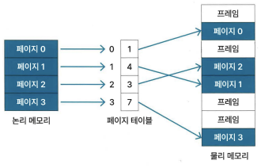
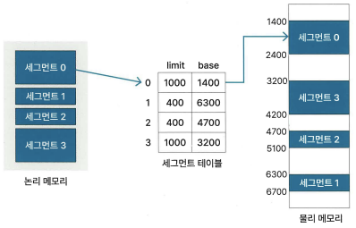

# 1장 - 운영체제

## 1.4 메모리 관리 전략

### 1.4.1 논리 메모리와 물리 메모리

논리 메모리 영역(= 가상 메모리 영역) - 프로세스가 보는 메모리 영역
물리 메모리 영역 - 실제 사용되는 메모리 영역

논리 주소(= 가상 주소) - CPU 프로세스를 실행하며 보는 주소 값
물리 주소 - 실제 메모리에서 사용되는 주소

MMU - 논리 주소를 물리 주소로 변환해줄 때 사용 하는 하드웨어 장치 / CPU에 위히
논리 주소 -> MMU -> 물리 주소로 변환하여 해당 주소의 데이터 얻음

### 1.4.2 연속 메모리 할당

연속 메모리 할당이란? 멀티 프로세스 환경에서 여러 프로세스를 메모리에 연속적으로 로드하는 방법

#### 고정 분할 방식

고정 분할이란? 메모리 영역을 미리 분할한 후, 각 영역별로 프로세스 할당

내부 단편화: 분할된 영역에 분할된 크기보다 작은 프로세스가 할당되어 메모리 공간이 남는 경우
외부 단편화: 분할된 영역에 분할된 크기보다 큰 프로세스가 할당될 수 없는 경우

#### 가변 분할 방식

가변 분할이란? 할당할 프로세스의 크기에 따라 메모리 공간을 분할하는 방식

1. 최초 접합(first-fit)
가용 메모리 공간에서 프로세스 크기만큼 비어 있는 메모리 공간을 차례대로 찾아 프로세스를 로드하는 방식
2. 최적 접합(best-fit)
'MIN(할당하려는 프로세스 크기 이상인 가용 메모리 공간 모두)'인 공간에 프로세스 할당
3. 최악 접합(worst-fit)
'MAX(할당하려는 프로세스 크기 이상인 가용 메모리 공간 모두)'인 공간에 프로세스 할당

##### 메모리 압축

(=메모리 집약)
프로세스가 사용 중인 메모리 공간을 재배치하여 흩어져 있는 가용 메모리 공간을 합치는 것
외부 단편화 문제를 해결

#### 1.4.3 비연속 메모리 할당 ⭐

비연속 메모리 할당이란? 프로세스의 메모리 영역을 연속되지 않은 메모리 공간에 저장하는 방법

##### 페이징

프로세스의 논리 메모리 영역과 물리 메모리 영역을 각각 동일한 크기의 페이지와 프레임으로 나눔
페이지와 프레임에는 각각 번호를 할당해 프로세스의 페이지와 메모리의 프레임을 페이지 테이블을 이용해 매핑한다.

프레임: 페이지가 들어가기 전의 영역

장점: 연속할당이 아니기에 외부 단편화가 존재하지 않음

단점 1: 프로세스 크기가 페이지 수로 나누어 떨어지는 지 모르기에 남는 공간이 생길 수 있으므로 내부 단편화 문제가 발생할 수 있음
(페이지 크기를 작게 하면 단편화가 적은가? 단점2로 가보자.)
단점 2: 페이지 테이블을 저장하기 위한 메모리 공간이 추가로 필요
(페이지 크기가 작을 수록 필요한 메모리 공간이 커짐 -> 일반적인 페이지 크기는 4 바이트)

###### 페이징 기법

* 계층적 페이징
  페이지 테이블을 다시 페이지로 나눠 페이지 테이블 자체를 페이징
* 해시 페이지 테이블
  해시 테이블의 각 항목에 저장된 연결 리스트에 페이지 번호를 해싱, 첫 번째 요소와 가상 페이지 번호를 비교
* 역 페이지 테이블
  프레임을 이용해 페이지를 찾는 방식

##### 세그먼테이션

프로세스의 메모리 영역을 논리적 단위인 세그먼트로 분할해 메모리 할당
세그먼테이션 테이블을 사용해 세그먼트의 논리 주소를 물리 주소로 매핑
세그먼테이션 테이블은 세그먼트 번호를 인덱스로 사용하며 세그먼트별 시작 주소인 base와 세그 먼트 길이인 limit 속성으로 함

장점: 프로세스의 메모리 영역을 논리적 단위로 나눠 저장하므로 단위별 데이터를 보호하기 쉬움

단점1: 세그먼트의 크기가 균등하지 않기에 외부 단편화 문제가 발생 가능
단점2: 메모리에 로드된 스택 세그먼트 영역에서 오버플로가 발생하면 다른 프로세스와 메모리 영역이 겹치는 문제가 생길 수 있기에 디스크로 스왑 아웃해야 함
