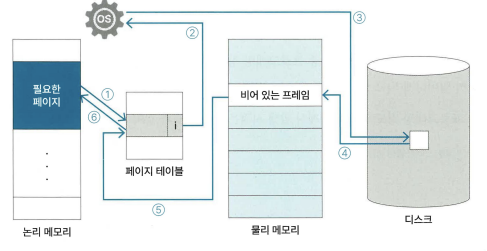
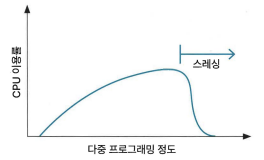

# 1장 - 운영체제

## 1.5 메모리 관리 전략

### 1.5.1 가상 메모리란 ⭐

가상 메모리란? 프로세스의 일부만 메모리에 로드, 나머지는 디스크에 둔 상태로 프로세스를 실행하는 방식

* 가상 메모리를 사용할 때의 장점
  * 프로그램이 메모리 크기에 대한 제약을 덜 받을 수 있음
  * 동시에 많은 프로그램을 실행하므로 CPU 이용률과 처리율을 높일 수 있음
  * 필요한 영역만 메모리에 로드해 스와핑 횟수를 줄여서 프로그램 실행 속도를 높일 수 있음

### 1.5.2 요구 페이징 ⭐

요구 페이징이란? 프로세스에서 필요한 페이지만 메모리에 로드하는 방식

논리 메모리 - 페이지 테이블 - 물리 메모리 - 디스크 의 구조

필요한 페이지를 물리 메모리에, 필요하지 않은 페이지는 디스크에 저장

페이지 폴트 - 프로그램을 실행하다가 물리 메모리에 필요한 페이지가 없을 경우

1. 필요한 페이지가 물리 메모리에 있는지 없는 지를 페이지 테이블에서 확인 / 페이지 폴트가 발생하면 i(invalid)를 반환 (페이지 폴트가 발생하지 않으면 v(valid) 반환)
2. i를 반환하면 OS는 참조하려는 페이지의 주소 값이 유효하지 않은지 아니면 메모리에 호드되지 않은 영역인지를 판단
3. 필요한 페이지가 메모리에 로드되지 않은 영역이라면 디스크에서 해당 영역을 찾음
4. 디스크에서 해당 페이지 영역을 *swap in* / 이 때 물리 메모리에 비어 있는 프레임이 있으면 페이지를 해당 영역에 바로 로드, 만약 비어 있는 프레임이 없으면 페이지 교체 할고리즘을 호출해 기존에 로드된 페이지를 디스크로 swap한 후에 새로운 페이지를 로드
5. 페이지 테이블에서 새로 로드한 페이지의 값을 v로 변경
6. 프로세스 재실행

### 1.5.3 스레싱

스레싱이란? 동시에 일정 수 이상의 프로그램을 실행했을 때 오히려 CPU 이용률이 떨어지는 상황

다중 프로그래밍은 페이지 폴트가 자주 일어나는데, 그렇게 되면 실질적인 CPU 이용률이 떨어짐

워킹 세트 - 스레싱을 예방하(페이지 폴트현상을 줄이기)기 위해 지역성을 기반으로 자주 사용하는 페이지를 저장해두는 것
