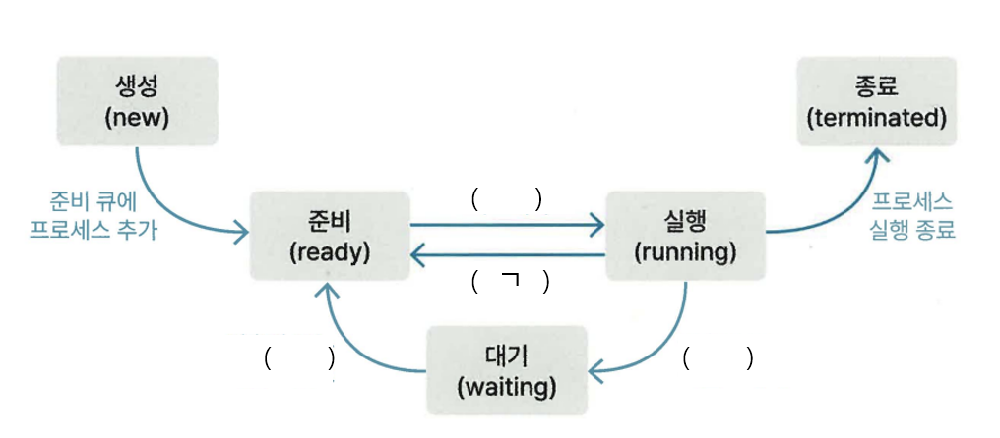

# 1장 시험

## 1, 2주차

1. 다음 중 RESTful API의 특징으로 옳지 않은 것을 고르시오.
a. Server-Client
b. Stateful
c. Cacheable
d. Uniform Interface

2. 자식 클래스는 부모 클래스로 대체 가능해야 한다는 객체 지향적 설계 원칙은?

3. 함수형 프로그래밍의 설명으로 옳지 않은 것을 고르시오.
a. Pure function라는 특성을 가지고 있다.
b. Immutable라는 특성을 가지고 있다.
c. 함수를 데이터처럼 취급할 수 없다.
d. 대입문을 사용하지 않는 프로그래밍이다.

## 4주차

1. 유닉스 및 유닉스 계열 운영 체제에서 주로 사용되는 프로세스를 생성하는 시스템 콜 함수는?

2. 빈칸 (ㄱ)에 들어갈 알맞은 말을 고르시오.

a. 디스패치
b. 인터럽트 발생
c. 입출력 또는 이벤트 대기
d. 입출력 또는 이벤트 완료

3. 다음은 프로세스 동기화에 관련된 용어에 대한 설명이다. 괄호에 들어갈 말로 알맞은 것은?
[설명]
(     )란, 공유 자원에 접근할 수 있고 접근 순서에 따라 결과가 달라지는 코드 영역이다.
(     )에 여러 접근이 동시에 발생하는 것을 방지하려면 다음 3가지의 조건을 충족해야 한다.

- 상호배제 기법
- 진행
- 한정된 대기
