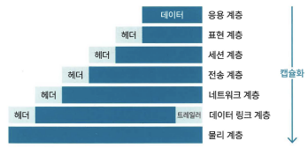
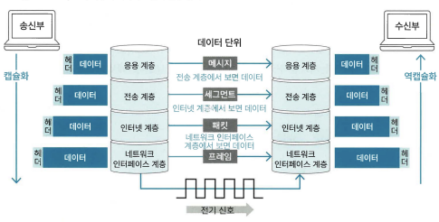
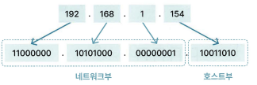
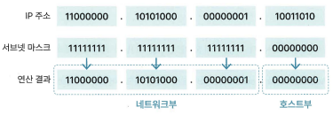

# 2장 - 컴퓨터 네트워크

## 2.1 네트워크 계층

### 2.1.1 OSI 7계층

OSI 7계층이란? 네트워크 통신이 이뤄지는 과정 7단계

데이터를 송신할 때는 높은 계층에서 낮은 계층으로 전달, 수신할 때는 낮은 계층에서 높은 계층으로 전달

캡슐화 - 송신할 때 각 계층에서 헤더나 트레일러를 붙여 보내는 것
        - 수신부의 같은 계층에서 데이터 호환성을 높이고 오류의 영향을 최소화하기 위함

* 7계층(응용 계층): HTTP, FTP 등의 프로토콜을 응용 프로그램의 UI를 통해 제공
* 6계층(표현 계증): 데이터를 표준화된 형식으로 변경
* 5계층(세션 계층): 세션의 유지 및 해제 등 응용 프로그램 간 통신 제어와 동기화
* 4계층(전송 계층): 신뢰성 있는 데이터를 전달하기 위한 계층으로, TCP, UDP 같은 전송 방식과 포트(port)번호 등을 결정
* 3계층(네트워크 계층): 데이터를 송신부에서 수신부까지 보내기 위한 최적 경로를 선택하는 라우팅(routing) 을 수행 (최적 경로 = 라우트(route)) 네트워크 계층의 장비로는 라우터(router)가 있음
* 2계층(데이터 링크 계층): 데이터 흐름을 관리하며 데이터의 오류 검줄 및 복구 등을 수행한다. 브리지(bridge)， 스위치(switch)， 이더넷(ethernet)이 데이터 링크 계층에 해당하는 장비
* 1계층(물리 계층): 데이터를 비트(bit) 단위의 0과 1로 변환한 후 장비로 전송 혹은 복원. 리피터(repeater)， 허브(hub) 등이 물리 계층에 해당하는 장비

역캡슐화 - 제어정보를 얻으며 헤더와 트레일러를 분석해 제거하는 것

프로토콜 - 통신 규약

### 2.1.2 TCP/IP

TCP/IP란? 인터넷에서 데이터를 주고받기 위한 네트워크 프로토콜 (ex.HTTP)

TCP - 데이터르르 나눈 패킷의 전달 여부와 전송 순서를 보장하는 전송 제어 프로토콜

IP - 패킷을 빠르게 보내는 인터넷 프로토콜

* 4계층(응용 계층) : 사용자와 소프트웨어를 연결해 주는 계증으로， HTTP, HTTPS, DNS 등의 프로토콜이 작동
* 3계층(전송 계층): 데이터의 신뢰성을 보장， 포트 번호로 데이터를 적절한 응용 프로그램에 전달. (프로토콜ex.TCP, UDP) (데이터 단위는 세그먼트(segment))
* 2계층(인터넷 계층): 데이터를 최종 목적지까지 도달할 수 있게 하는 계층. (프로토콜ex.IP) 전송 계층으로부터 받은 데이터에 헤더를 붙여 캡슐화하는데， 이를 패킷 또는 데이터그램(datag ram) 이라고 함.
* 1계층(네트워크 인터페이스 계층) : 네트워크 접근 계증이라고도 하며， 데이터를 전기 신호로 변환하고 MAC 주소를 사용해 기기에 데이터를 전달한다. 이더넷 Wi-Fi 등이 해당 계층에 속하는 대표적인 프로토콜이다.

➕ 패킷(packet)이란? 네트워크에서 주고받는 데이터를 작게 분할한 단위
➕ MAC 주소(Media Access Control address): 하드웨어 고유의 주소

#### IP 주소

IP 주소란? IP에서 컴퓨터 또는 네트워크 장치를 식별하기 위한 값

네트워크부와 호스트부로 나뉨

네트워크부 - 해당 주소가 어떠한 네트워크에 속해 있는지 구분하는 값

호스트 부 - 해당 네트워크에서 어떠한 기기인지를 나타내는 값

IPv4

서브넷 마스크 - IP 주소와 and 연산을 하면 IP 주소에서 네트워크부와 호스트부를 알 수 있음

