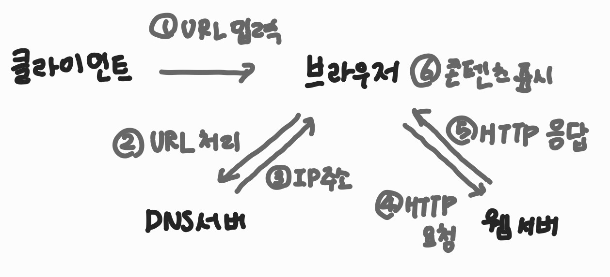

# 2장 - 컴퓨터 네트워크

## 2.3 HTTP

### 2.3.1 HTTP ⭐

데이터 전송 프르토콜 on 인터넷 in TCP/IP 계층에서 4계층(응용 계층)

- HTTP의 특징

1. 비연결성
   - 클라이언트에서 요청을 보낸 후 서버로부터 응답을 받으면 연결을 끊는 것
   - 연결 = 자원 필요     연결 헤제 -> 자원을 아낄 수 있음 -> 불특정 다수를 대상으로 하는 서비스에 유리
   - 지속적인 연결을 하려면 연결과 해제를 반복하여 자원 낭비 -> 일정 시간 연결 유지 HTTP Keep Alive 헤더
2. 무상태
   - 서버에서 클라이언트의 상태 저장 X
   - 클라이언트가 요청에 필요한 데이터를 모두 담아야 함
   - 보조저장방법1: 쿠키(클라이먼트 웹 브라우저에 조금 저장해두기)
   - 보조저장방법2: 세션(서버에서 클라이언트와의 연결 정보 저장 관리(보안은 쿠키보다 좋으나 접속자 많으면 서버 과부하))
   - 클라이언트의 요청에 응답하는 서버가 바뀌어도 되기 때문에 서버 확장성 높음

- HTTP 메시지 구조
  - 요청 메시지 (클라이언트 -> 서버)
    - 요청 라인: 요청 URI, 요청 방법, HTTP 버전
    - 헤더: 키-값으로 구성된 다수의 헤더 항목
    - 빈 줄: 헤더와 바디를 구분하는 헤더의 끝
    - 바디: 요청할 때 요청 방법 메서드가 POST인 경우 메시지를 담기 위해 존재
  - 응답 메시지 (서버 -> 클라이언트)
    - 상태 라인: 요청에 대한 HTTP 상태 코드와 HTTP 버전
    - (이하는 요청 메시지와 동일)

#### HTTP 상태 코드

HTTP 상태 코드란? 클라이언트의 요청에 대한 서버의 상태를 할려줌

1xx: 클라이언트로부터 요청을 받아 처리 중
2xx: 요청을 성공적으로 처리함
3xx: 요청을 처리하기 위해 추가 처리 필요
4xx: 클라이언트 오류
5xx: 서버 오류

### 2.3.2 HTTPS ⭐

HTTPS 보안 계층인 SSL/TLS를 이용해 HTTP의 보안을 강화한 웹 통신 프로토콜

SSL - 암호화 프로토콜 방식

TLS - 업그레이드 된 암호화 프로토콜 방식

-> 그냥 SSL/TLS라고 부름

TCP 4계층에서 응용 계층과 전송 계층 사이에 보안 계층이 생긴.ver

#### 암호화 방식

SSL/TLS에서는 암호화 2가지 방식

- 대칭 키 암호화 방식
- 공개 키 암호화 방식

### 2.3.3 웹 페이지 접속 과정 ⭐

