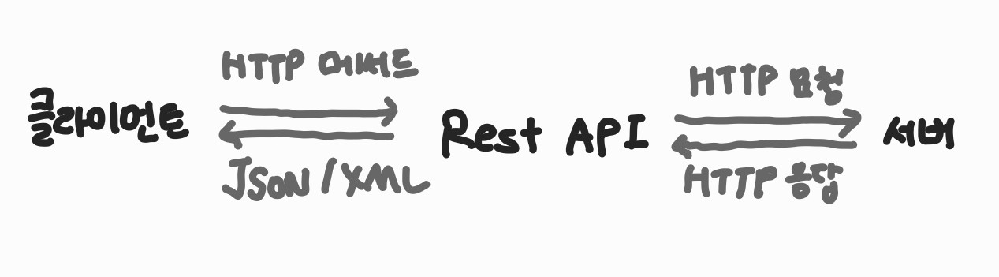

# 2장 - 컴퓨터 네트워크

## 2.3 REST

### 2.4.1 REST란

REST란? HTTP 통신을 활용하기 위해 고안된 아키텍쳐

RE(REpresentional) - URI로 표현

ST(State Transfer) - 자원을 명시해 연산을 수행하고 상태를 주고 받음

- REST 특징
  - 일관된 인터페이스
  - 클라이언트-서버 구조
  - 무상태성
  - 캐싱
  - 자체 표현 구조
  - 계층형 구조

### 2.4.2 REST API ⭐

REST 기반의 API

자원 - URI
행위 - HTTP 메서드
표현 - JSON, XML

#### RESTful API

REST 규칙의 API

- REST API를 최대한 RESTful하게 사용하는 법
  - 자원에 대한 행위는 HTTP 메서드로 나타내며, HTTP 메서드나 행위에 대한 표현이 URI에 들어가면 안 됨
  - HTTP 메서드는 명시적이어야 한다.
  - URI 경로는 '/'로 계층 관계 표현
  - URI 경로는 '_'를 사용하면 안 되고 소문자 지향

### 2.4.3 HTTP 메서드 ⭐

(생성 / 조회 / 갱신 / 제거) 목적

(POST / GET / PUT / DELETE) HTTP 메서드

(Create, Read, Update, Delete) CRUD
