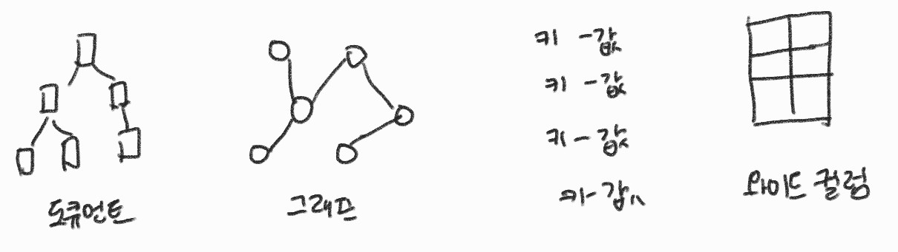

# 3장 - 데이터베이스

## 3.1 데이터베이스의 종류

### 3.1.1 데이터베이스란

DB란? 사용하기 위해 저장 및 관리하는 데이터 집합 / 대용량 데이터 저장 및 관리 가능

* DB의 특징
  * 실시간 접근: 언제든지 접근해 처리 가능
  * 동시 공유: 다수 사용자 접근 가능
  * 지속적인 변화: 데이터의 갱신, 삽입, 삭제 등을 통해 계속해서 변화
  * 내용 기반 참조: 데이터의 값 이용해 데이터에 접근 가능

* DB의 요소
  * 개체: 데이터로 표현하려는 대상, 하나 이상의 속성으로 구성
  * 속성: 개체의 특성과 상태, 데이터베이스를 구성하는 가장 작은 논리적 단위
  * 관계: 개체 간의 관련, 주로 동사

스키마: DB의 전체적인 구조와 제약 조건 정의

#### 스키마의 종류

개념 스키마(사용자) - 개념 스키마(전체) - 외부 스키마(물리 저장장치)

### 3.1.2 관계형 데이터베이스 ⭐

RDB란? 2차원 테이블에 저장되며 데이터의 구조와 데이터 간 종속성을 알 수 있는 DB

테이블을 이용해 데이터의 종속성과 관계 나타냄

테이블 - 키-값으로 이루어진 2차원 형태, 행과 열로 구성

행(튜플, 레코드) - 데이터 묶음 / 열(필드)- [이름,타입]을 가진 속성

### 3.1.3 NoSQL 데이터베이스

NoSQL이란? 비관계형, 유연한 DB

대용량 데이터 조회 속도가 유리하며, 수평적 확장성이 좋음(서버 추가하는 DB확장 용이) -> 데이처 확장과 대용량 데이터 조회가 빈번한 경우

#### 또 다른 데이터베이스

계층형DB: 데이터 간에 부모-자식 관계를 갖는 트리 형태의 DB, 개체 간 1:N 관계를 갖기 때문에 일대다 관계라고도 함

네트워크형DB: 트리 형태의 DB나 계층형 DB와 달리 개체 간에 N:M 관계를 갖는 그래프 구조
