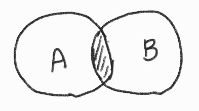
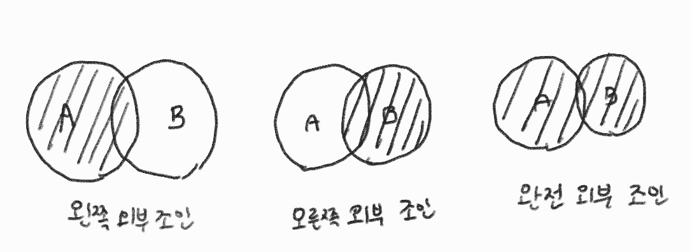

# 3장 - 데이터베이스

## 3.4 관계형 데이터베이스

### 3.4.1 조인이란

조인이란? 데이블 합치기

* 조인 연산자 종류
  * ON: 어떤 테이블
  * USING: 속성명이 동일할 때, USING 연산자 뒤에 공통되는 속성명만 작성해 조건을 간단하게 적을 수 있음
  * WHERE: 조건
  * IN: 이 중에서
  * BETWEEN: 이 사이에서
  * LIKE: 이 문자 포함하는

### 3.4.2 내부 조인

내부 조인이란? 2개 이상의 테이블에서 공통 속성을 가진 데이터를 검색하기 위한 연산

### 3.4.3 외부 조인

외부조인이란? 테이블에서 조인 조건에 해당하는 속성 값이 없는 데이터까지 모두 조회하는 연산, (존재하지 않는 데이터에 대해서는 NULL로 표기)

